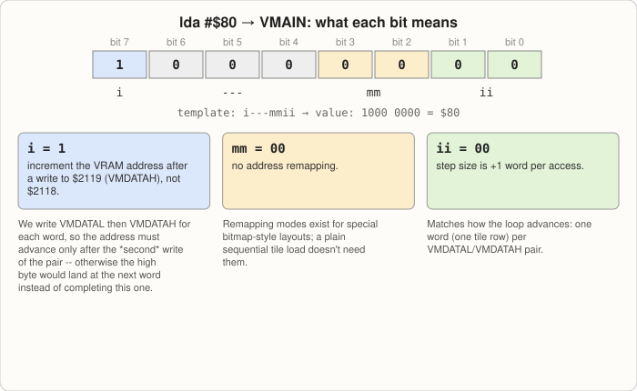

# Lesson 5: Tiles & VRAM

**Goal:** understand how pixel graphics are actually encoded in VRAM, and load
your first tile. Nothing will look different on screen yet — like Lesson 4, this
lesson builds a piece that only pays off once [Lesson
6](06-backgrounds-and-tilemaps.md) puts it on screen.

## Tiles are bitplanes, not pixels

A SNES "tile" is always an 8×8 grid of pixels, but the data isn't stored as one
byte per pixel the way you might picture a bitmap. It's stored as **bitplanes**:
separate 8×8 1-bit images that get combined to produce each pixel's color
*index* (not its color — the index then looks up a real color in the CGRAM
palette you built in [Lesson 4](04-palettes-and-cgram.md)).

The number of bitplanes determines how many colors a tile can use:

| Format | Bitplanes | Colors per tile | Bytes per tile |
|---|---|---|---|
| 2bpp | 2 | 4 | 16 |
| 4bpp | 4 | 16 | 32 |
| 8bpp | 8 | 256 | 64 |

This tutorial starts with **2bpp**, the simplest format and the one used by
`BG3` in graphics mode 1 (the mode [Lesson 6](06-backgrounds-and-tilemaps.md)
uses) — the smallest amount of new information to absorb before something
shows up on screen.

### How the bytes are laid out

Per the [register reference's tile character data
section](https://wiki.superfamicom.org/backgrounds#tile-maps--character-maps):
each row of a tile is one byte per bitplane, and for 2bpp, bitplane 0 and
bitplane 1 of a row are stored as the low and high byte of one 16-bit word.
Eight rows means eight words means 16 bytes, in this exact order:

```
row 0: bitplane0, bitplane1
row 1: bitplane0, bitplane1
row 2: bitplane0, bitplane1
...
row 7: bitplane0, bitplane1
```

Within a byte, bit 7 is the *leftmost* pixel of that row. A pixel's final color
index is built by stacking the corresponding bit from each bitplane: for 2bpp,
`index = (bitplane1_bit << 1) | bitplane0_bit`. So index 1 needs bitplane0=1,
bitplane1=0; index 2 needs bitplane0=0, bitplane1=1; index 3 needs both bits
set.


*Figure: the 16 bytes in memory (top), and how one byte's bits map onto the 8 pixel columns of a row (bottom).*

### A worked example: a two-color striped tile

Let's build a tile that's solid palette-index-1 (red, from Lesson 4's table) on
its top half and solid palette-index-2 (green) on its bottom half — simple
enough to hand-encode, and it visibly proves bitplane combination is working
once you see it rendered.

Index 1 needs bitplane0 = all 1s, bitplane1 = all 0s, for those rows. Index 2
needs the opposite. So:

```asm
tile_stripe:
    ; Rows 0-3: color index 1 (red) -> bitplane0=$FF, bitplane1=$00
    .byte $FF, $00
    .byte $FF, $00
    .byte $FF, $00
    .byte $FF, $00
    ; Rows 4-7: color index 2 (green) -> bitplane0=$00, bitplane1=$FF
    .byte $00, $FF
    .byte $00, $FF
    .byte $00, $FF
    .byte $00, $FF
tile_stripe_end:
```


*Figure: working the bit-stacking formula for one row of each half, then the resulting rendered tile.*

## VMAIN, VMADD, and VMDATA

VRAM is addressed as 32K *words* (64 KB total), and the write path is the same
"address register, then data register" pattern from
[Lesson 3](03-memory-map-and-registers.md#vram-cgram-and-oam-three-porthole-devices):

```
$2115  VMAIN   i---mmii   i = increment after high ($2119) or low ($2118) byte write
$2116  VMADDL  low byte of the word address
$2117  VMADDH  high byte of the word address
$2118  VMDATAL low byte of the word to write
$2119  VMDATAH high byte of the word to write
```

Since we're writing 16-bit words (and our tile data is already laid out as
byte-pairs matching VRAM's word layout), set `VMAIN` so the address advances
*after the high byte* — that way a `VMDATAL`/`VMDATAH` pair advances the address
exactly once, keeping the two writes atomic from the address register's point of
view:

```asm
    lda #$80        ; i=1 (increment after $2119), ii=00 (+1), mm=00 (no remap)
    sta $2115
```

Concretely: `$80` in binary is `1000 0000`. Lined up against the `i---mmii`
template, that's `i=1`, the three middle bits unused, `mm=00`, and `ii=00`.
`i=1` is the bit that matters here — it says "advance the address after a
write to $2119 (VMDATAH)," not $2118. Since the loop below always writes
`VMDATAL` then `VMDATAH` for a given word, the address must only advance
*after* that second write; if it advanced after the low byte instead, the
address would already be pointing at the *next* word by the time the high
byte lands, splitting one word's two halves across two different VRAM
locations. `mm=00` means no address remapping (only relevant for special
bitmap-style graphics modes this tutorial doesn't use), and `ii=00` means
each completed word write advances the address by exactly 1 word — matching
one tile row per loop iteration.



*Figure: `$80`'s bits mapped onto VMAIN's fields, and what each one does.*

## Extending your ROM

Add the tile data (shown above) somewhere in your `CODE` segment, then add a
loading loop to `reset:`, after the palette loop from Lesson 4:

```asm
    ; --- Load tile_stripe into VRAM at word address 0. ---
    lda #$80
    sta $2115           ; VMAIN: increment after high byte

    stz $2116           ; VMADDL: word address 0, low byte
    stz $2117           ; VMADDH: word address 0, high byte

    ldx #0
@tile_loop:
    lda tile_stripe,x    ; bitplane0 byte
    sta $2118            ; VMDATAL
    inx
    lda tile_stripe,x    ; bitplane1 byte
    sta $2119            ; VMDATAH
    inx
    cpx #(tile_stripe_end - tile_stripe)
    bne @tile_loop
```

Notice the shape: set an address register once, then loop two bytes at a time
into two data registers, watching a computed byte count. This is the *third*
time you've written almost this exact loop — CGRAM in Lesson 4, and now VRAM.
That repetition is the point: once you can spot "porthole register loading
loop" as a pattern, you can read almost any beginner SNES tutorial's graphics
code at a glance, including code that isn't part of this tutorial.

## Build and run

Assemble and run exactly as before. The screen will look unchanged (still
whatever backdrop color Lesson 4 left palette index 0 as) — you've written a
tile into VRAM, but nothing has told the PPU to *display* it yet. That's the
entire subject of [Lesson 6](06-backgrounds-and-tilemaps.md): a tilemap that
references this tile, and the registers that turn a background layer on.

If you want to confirm the tile data actually landed in VRAM rather than taking
it on faith, [Lesson 7](07-debugging-with-mesen.md) shows you how to open
Mesen's VRAM/tile viewer and look at it directly — a good habit to build before
you're debugging something more complicated than a two-color stripe.

## Exercises

1. Hand-encode a checkerboard 2bpp tile (alternating index 1 and index 2 in a
   2×2-pixel-block pattern, not a stripe) by working out the bitplane bytes row
   by row. This is tedious by hand on purpose — it's exactly the tedium real
   SNES projects solve with graphics conversion tools that turn a PNG into this
   byte format automatically, which is worth knowing exists even though this
   tutorial encodes tiles by hand for teaching purposes.
2. What would change in `tile_stripe` if you wanted a solid single-color tile
   using index 3 instead of a two-color stripe?
3. Calculate how many 2bpp tiles fit in the SNES's 64 KB of VRAM. Then do the
   same for 4bpp. Why do you think Lesson 6 defaults to the smaller format for
   the first background layer we turn on?

---

[Home](docs/index.html) |
Previous: [Lesson 4 — Palettes & CGRAM](04-palettes-and-cgram.md)
Next: [Lesson 6 — Backgrounds & tilemaps](06-backgrounds-and-tilemaps.md)
