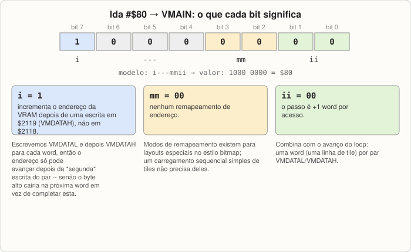

# Lição 5: Tiles & VRAM

**Objetivo:** entender como gráficos de pixel são de fato codificados na VRAM, e
carregar seu primeiro tile. Nada vai parecer diferente na tela ainda — assim como a
Lição 4, esta lição constrói uma peça que só compensa quando a [Lição
6](06-backgrounds-and-tilemaps.md) a coloca na tela.

## Tiles são bitplanes, não pixels

Um "tile" do SNES é sempre uma grade 8×8 de pixels, mas os dados não são
armazenados como um byte por pixel, do jeito que você talvez imagine um bitmap.
Eles são armazenados como **bitplanes**: imagens 8×8 de 1 bit separadas, que são
combinadas para produzir o *índice* de cor de cada pixel (não sua cor — o índice
então busca uma cor real na paleta da CGRAM que você construiu na [Lição
4](04-palettes-and-cgram.md)).

O número de bitplanes determina quantas cores um tile pode usar:

| Formato | Bitplanes | Cores por tile | Bytes por tile |
|---|---|---|---|
| 2bpp | 2 | 4 | 16 |
| 4bpp | 4 | 16 | 32 |
| 8bpp | 8 | 256 | 64 |

Este tutorial começa com **2bpp**, o formato mais simples e o usado pelo `BG3` no
modo gráfico 1 (o modo que a [Lição 6](06-backgrounds-and-tilemaps.md) usa) — a
menor quantidade de informação nova para absorver antes de algo aparecer na tela.

### Como os bytes são organizados

Segundo a [seção de dados de caractere de tile da referência de
registradores](https://wiki.superfamicom.org/backgrounds#tile-maps--character-maps):
cada linha de um tile é um byte por bitplane, e para 2bpp, o bitplane 0 e o
bitplane 1 de uma linha são armazenados como o byte baixo e o byte alto de uma word
de 16 bits. Oito linhas significam oito words, que significam 16 bytes, exatamente
nesta ordem:

```
row 0: bitplane0, bitplane1
row 1: bitplane0, bitplane1
row 2: bitplane0, bitplane1
...
row 7: bitplane0, bitplane1
```

Dentro de um byte, o bit 7 é o pixel *mais à esquerda* daquela linha. O índice de
cor final de um pixel é construído empilhando o bit correspondente de cada
bitplane: para 2bpp, `índice = (bit_do_bitplane1 << 1) | bit_do_bitplane0`. Então o
índice 1 precisa de bitplane0=1, bitplane1=0; o índice 2 precisa de bitplane0=0,
bitplane1=1; o índice 3 precisa dos dois bits ligados.


*Figura: os 16 bytes na memória (acima), e como os bits de um byte mapeiam para as 8 colunas de pixel de uma linha (abaixo).*

### Um exemplo resolvido: um tile listrado de duas cores

Vamos construir um tile que é sólido no índice-de-paleta-1 (vermelho, da tabela da
Lição 4) na metade de cima e sólido no índice-de-paleta-2 (verde) na metade de
baixo — simples o suficiente para codificar manualmente, e prova visualmente que a
combinação de bitplanes está funcionando assim que você vê renderizado.

O índice 1 precisa de bitplane0 = tudo 1, bitplane1 = tudo 0, para essas linhas. O
índice 2 precisa do oposto. Então:

```asm
tile_stripe:
    ; Rows 0-3: color index 1 (red) -> bitplane0=$FF, bitplane1=$00
    .byte $FF, $00
    .byte $FF, $00
    .byte $FF, $00
    .byte $FF, $00
    ; Rows 4-7: color index 2 (green) -> bitplane0=$00, bitplane1=$FF
    .byte $00, $FF
    .byte $00, $FF
    .byte $00, $FF
    .byte $00, $FF
tile_stripe_end:
```


*Figura: aplicando a fórmula de empilhamento de bits para uma linha de cada metade, e o tile renderizado resultante.*

## VMAIN, VMADD e VMDATA

A VRAM é endereçada como 32K *words* (64 KB ao todo), e o caminho de escrita é o
mesmo padrão "registrador de endereço, depois registrador de dados" da [Lição
3](03-memory-map-and-registers.md#vram-cgram-and-oam-three-porthole-devices):

```
$2115  VMAIN   i---mmii   i = increment after high ($2119) or low ($2118) byte write
$2116  VMADDL  low byte of the word address
$2117  VMADDH  high byte of the word address
$2118  VMDATAL low byte of the word to write
$2119  VMDATAH high byte of the word to write
```

Já que estamos escrevendo words de 16 bits (e nossos dados de tile já estão
organizados como pares de bytes que batem com o layout de word da VRAM), configure
`VMAIN` para que o endereço avance *depois do byte alto* — assim um par
`VMDATAL`/`VMDATAH` avança o endereço exatamente uma vez, mantendo as duas
escritas atômicas do ponto de vista do registrador de endereço:

```asm
    lda #$80        ; i=1 (increment after $2119), ii=00 (+1), mm=00 (no remap)
    sta $2115
```

Concretamente: `$80` em binário é `1000 0000`. Alinhado ao template
`i---mmii`, isso é `i=1`, os três bits do meio sem uso, `mm=00`, e `ii=00`.
`i=1` é o bit que importa aqui — ele diz "avance o endereço depois de uma
escrita em $2119 (VMDATAH)", não em $2118. Como o loop abaixo sempre escreve
`VMDATAL` e depois `VMDATAH` para uma mesma word, o endereço só pode avançar
*depois* dessa segunda escrita; se avançasse depois do byte baixo, o endereço
já estaria apontando para a *próxima* word quando o byte alto chegasse,
dividindo as duas metades de uma word entre dois locais diferentes da VRAM.
`mm=00` significa nenhum remapeamento de endereço (relevante só em modos
gráficos especiais no estilo bitmap, que este tutorial não usa), e `ii=00`
significa que cada word completa escrita avança o endereço em exatamente 1
word — combinando com uma linha de tile por iteração do loop.



*Figura: os bits de `$80` mapeados nos campos de VMAIN, e o que cada um faz.*

## Estendendo sua ROM

Adicione os dados de tile (mostrados acima) em algum lugar do seu segmento `CODE`,
depois adicione um loop de carregamento em `reset:`, depois do loop de paleta da
Lição 4:

```asm
    ; --- Load tile_stripe into VRAM at word address 0. ---
    lda #$80
    sta $2115           ; VMAIN: increment after high byte

    stz $2116           ; VMADDL: word address 0, low byte
    stz $2117           ; VMADDH: word address 0, high byte

    ldx #0
@tile_loop:
    lda tile_stripe,x    ; bitplane0 byte
    sta $2118            ; VMDATAL
    inx
    lda tile_stripe,x    ; bitplane1 byte
    sta $2119            ; VMDATAH
    inx
    cpx #(tile_stripe_end - tile_stripe)
    bne @tile_loop
```

Repare no formato: configure um registrador de endereço uma vez, depois faça um
loop de dois bytes por vez em dois registradores de dados, observando uma contagem
de bytes calculada. Essa é a *terceira* vez que você escreve quase exatamente esse
mesmo loop — CGRAM na Lição 4, e agora VRAM. Essa repetição é o ponto: uma vez que
você consiga identificar o "loop de carregamento de registrador vigia" como um
padrão, você consegue ler o código gráfico de quase qualquer tutorial de SNES para
iniciantes de relance, incluindo código que não faz parte deste tutorial.

## Compile e execute

Monte e execute exatamente como antes. A tela vai parecer inalterada (ainda a cor
de fundo que a Lição 4 deixou no índice 0 da paleta) — você escreveu um tile na
VRAM, mas nada ainda disse à PPU para *exibi-lo*. Esse é o assunto inteiro da
[Lição 6](06-backgrounds-and-tilemaps.md): um tilemap que referencia esse tile, e
os registradores que ligam uma camada de background.

Se você quiser confirmar que os dados do tile de fato chegaram na VRAM em vez de
simplesmente confiar, a [Lição 7](07-debugging-with-mesen.md) mostra como abrir o
visualizador de VRAM/tiles do Mesen e olhar diretamente — um bom hábito para
construir antes de você estar depurando algo mais complicado que uma listra de
duas cores.

## Exercícios

1. Codifique manualmente um tile 2bpp em xadrez (alternando índice 1 e índice 2
   em um padrão de blocos de 2×2 pixels, não uma listra), trabalhando os bytes de
   bitplane linha por linha. Isso é tedioso à mão de propósito — é exatamente o
   tédio que projetos reais de SNES resolvem com ferramentas de conversão gráfica
   que transformam um PNG nesse formato de byte automaticamente, o que vale a pena
   saber que existe mesmo que este tutorial codifique tiles à mão para fins
   didáticos.
2. O que mudaria em `tile_stripe` se você quisesse um tile sólido de uma única
   cor usando o índice 3, em vez de uma listra de duas cores?
3. Calcule quantos tiles 2bpp cabem nos 64 KB de VRAM do SNES. Depois faça o
   mesmo para 4bpp. Por que você acha que a Lição 6 usa por padrão o formato menor
   para a primeira camada de background que ligamos?

---

[Home](../docs/pt/index.html) |
Previous: [Lição 4 — Paletas & CGRAM](04-palettes-and-cgram.md)
Next: [Lição 6 — Backgrounds & tilemaps](06-backgrounds-and-tilemaps.md)
